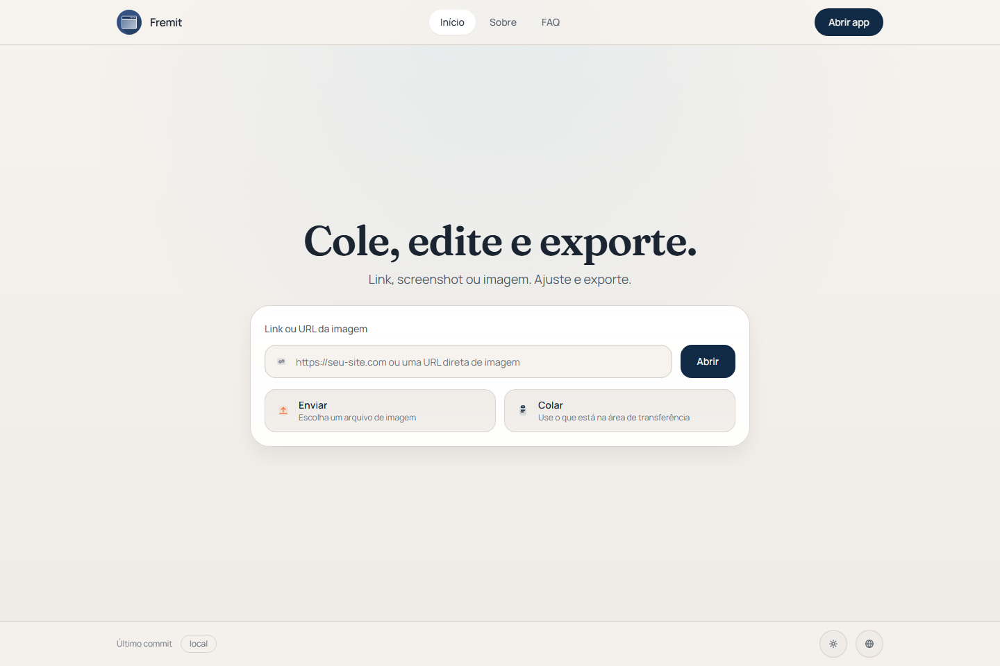
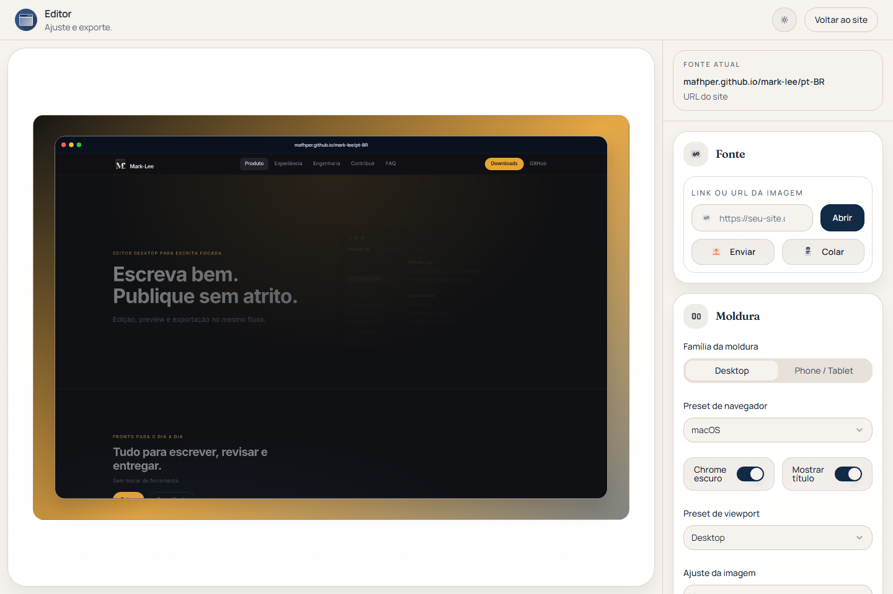

# Fremit

Turn links, screenshots, and image URLs into cleaner presentation assets.



Fremit is a static app for turning screenshots, image URLs, and best-effort website previews into cleaner presentation assets. It runs entirely on GitHub Pages and is now structured as a product site plus a dedicated editor.

## Live Demo

[https://mafhper.github.io/fremit/](https://mafhper.github.io/fremit/)

## Current Feature Set

- Upload screenshots or paste images from the clipboard
- Import direct image URLs
- Try website URLs through Microlink screenshot or Open Graph fallback
- Keep the last valid composition when a new website preview fails
- Switch between desktop browser frames and simple phone/tablet frames
- Use portrait or landscape orientation for phone/tablet frames
- Tune viewport preset, shadow, radius, fit mode, background, and export scale

## Honest URL Behavior

Fremit does not run a real browser in the backend. Website URLs are resolved in this order:

1. Microlink screenshot
2. Open Graph image
3. Manual fallback message asking for a screenshot

If no reliable preview is available, the current composition stays in place.

## Stack

- React 19
- TypeScript 5.9
- Vite 7
- React Router
- Zustand
- Tailwind CSS
- Radix UI primitives
- `html-to-image`
- `colorthief`
- `images.weserv.nl`
- Microlink
- Vitest
- Playwright



## Getting Started

```bash
bun install
bun run dev
```

The dev server runs on Vite's default port unless you pass a custom one.

## Scripts

```bash
bun run dev
bun run build
bun run lint
bun run test
bun run test:smoke
```

## GitHub Pages

This project is configured for GitHub Pages deployment through `.github/workflows/deploy.yml`.

- GitHub Actions installs with `bun install --frozen-lockfile`
- GitHub Actions builds with `bun run build`
- `vite.config.ts` uses `base: '/fremit/'`
- `public/404.html` handles SPA deep-link fallback
- `src/main.tsx` restores redirected routes after a Pages refresh

## Project Notes

- The app is intentionally static and zero-cost.
- Mobile and tablet frames are generic by design, not hardware simulations.
- Long-lived project history and saved presets are still out of scope for this phase.

## Verification

The current repo passes:

- `bun run build`
- `bun run lint`
- `bun run test`
- `bun run test:smoke`

## License

MIT
