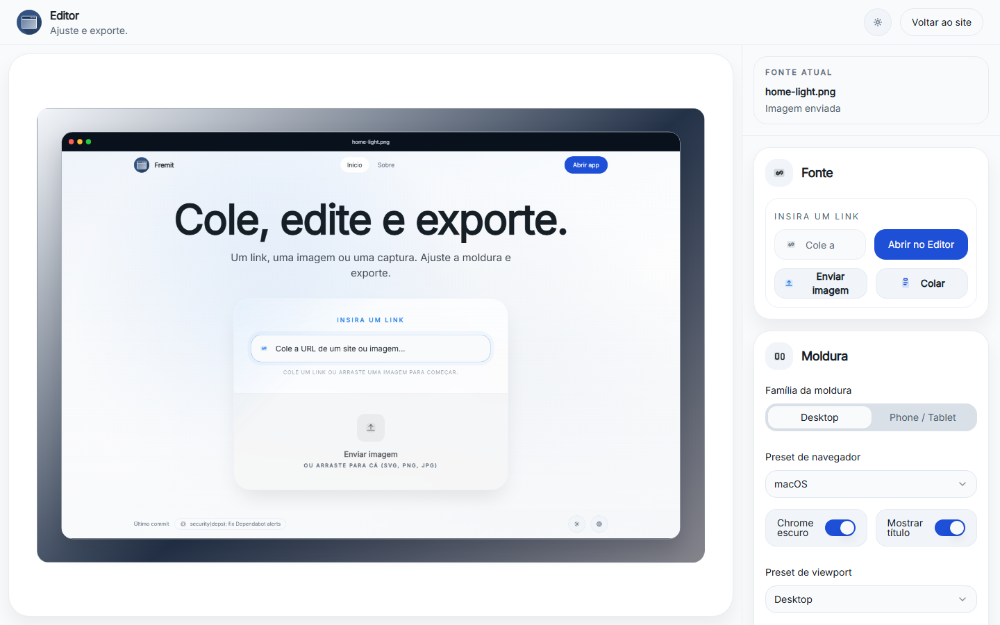

# Fremit

Turn links, screenshots, and image URLs into polished presentation assets.

[Open the live app](https://mafhper.github.io/fremit/)


Fremit is a static React app for creating framed mockups from a website link, direct image URL, uploaded screenshot, or pasted image. It runs on GitHub Pages and is split into a public promo site plus a focused editor workspace.

## What It Does

- Imports screenshots, clipboard images, and direct image URLs
- Waits for dynamic website content before capturing through Microlink, then falls back to Open Graph images
- Captures a chosen public route or an optional CSS-selected section
- Keeps the last successful composition when a later URL preview fails
- Frames content in desktop browser, phone, or tablet mockups
- Supports portrait and landscape device orientations
- Tunes viewport preset, shadow, radius, image fit, zoom, focal position, background, format, and export scale
- Exports the current canvas as PNG or JPG through `html-to-image`
- Supports English, Portuguese, and Spanish UI copy



## URL Preview Contract

Fremit is intentionally static. It does not run a backend browser or access private sessions.

Website URLs are resolved in this order:

1. Microlink screenshot after the selected 1, 3, or 5 second render wait
2. Open Graph image
3. Manual fallback asking for a screenshot

The editor keeps the active URL editable so a public route can be captured directly. An optional CSS selector waits for and crops a specific section. Use an uploaded screenshot for authenticated pages, private apps, interaction-only states, or any page where the generated URL preview still does not match the desired state.

## Stack

- React 19
- TypeScript 6
- Vite 8
- React Router 8
- Zustand
- Tailwind CSS 4
- Radix UI primitives
- `html-to-image`
- `colorthief`
- `images.weserv.nl`
- Microlink
- Vitest
- Playwright

## Getting Started

Node.js 24 and npm 11 are the supported local toolchain, matching GitHub Actions.

```bash
npm ci
npm run dev
```

Vite serves the app at `/fremit/`, matching the GitHub Pages base path. Use `npm install` only when intentionally changing dependencies and refreshing `package-lock.json`.

## Scripts

| Command | Purpose |
| --- | --- |
| `npm run dev` | Start the Vite development server. |
| `npm run build` | Type-check the project and create the production build. |
| `npm run preview` | Serve the production build locally on port 4273. |
| `npm run lint` | Run ESLint across the repository. |
| `npm run test` | Run the Vitest unit suite once. |
| `npm run test:watch` | Run Vitest in watch mode. |
| `npm run test:smoke` | Run Chromium smoke, accessibility, and contrast tests. |
| `npm run audit:security` | Fail on high or critical npm vulnerabilities. |

## GitHub Pages

Deployment is handled by `.github/workflows/deploy.yml`.

- Pull requests and `main` run lint, unit tests, build, and browser smoke checks in `.github/workflows/ci.yml`
- GitHub Actions installs with `npm ci`
- GitHub Actions builds with `npm run build`
- `vite.config.ts` sets `base: '/fremit/'`
- `public/404.html` handles SPA deep-link fallback
- `src/main.tsx` restores redirected routes after a Pages refresh

## Dependency Safety

The repository uses npm as the single package manager and commits `package-lock.json` for deterministic installs. Dependabot tracks npm and GitHub Actions updates, while Dependency Guard audits dependency-changing pull requests without lifecycle scripts or repository secrets.

- GitHub Actions are pinned to full commit SHAs and use explicit permissions.
- Dependency Guard verifies npm registry signatures, runs the security audit, and rejects high-severity dependency changes.
- CodeQL analyzes GitHub Actions and JavaScript/TypeScript on pull requests and pushes to `main`.
- Secret scanning and push protection are enabled.
- `main` requires pull requests, resolved review conversations, a current branch, and the `lint, test, and build` plus `browser smoke and accessibility` checks.

## Verification

Use the full local gate before publishing changes:

```bash
npm run lint
npm run build
npm run test
npm run test:smoke
```

For dependency or lockfile changes, also run:

```bash
npm ci --ignore-scripts
npm run audit:security
npm audit signatures
```

The security audit and dependency review action fail on any high or critical finding. Neither gate uses advisory exceptions, so dependency updates must leave the committed lockfile free of known high-severity vulnerabilities.

## Project Notes

- The app is intentionally static and zero-cost.
- Mobile and tablet frames are generic mockups, not hardware simulations.
- Saved projects and long-lived composition history are out of scope for this phase.

## License

This repository currently does not publish a `LICENSE` file.
